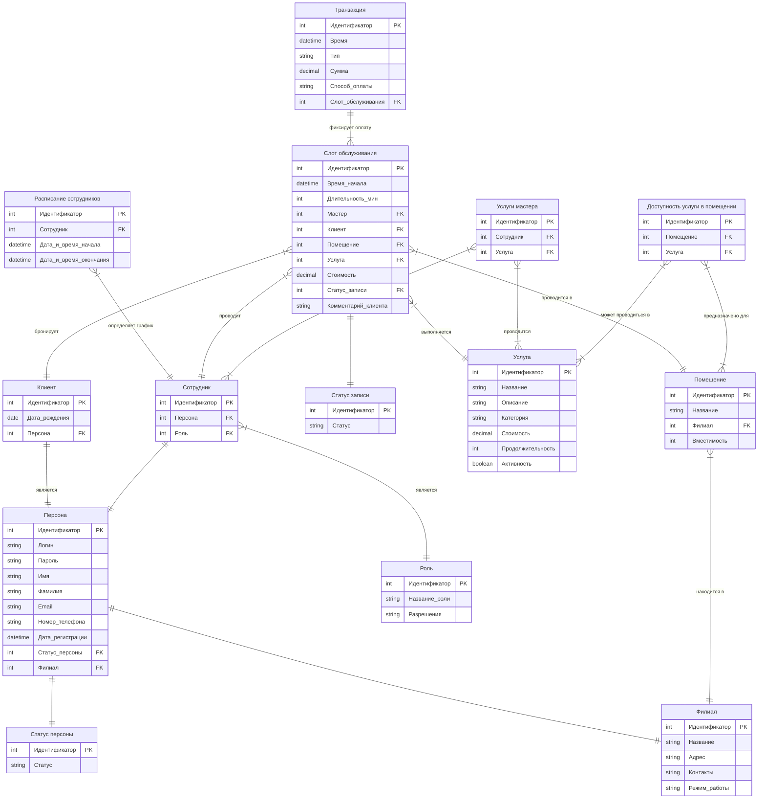

# Диаграмма классов

```mermaid
erDiagram
    CLIENT["Клиент"] {
        int Идентификатор PK
        date Дата_рождения
        int Персона FK
    }

    PERSON["Персона"] {
        int Идентификатор PK
        string Логин
        string Пароль
        string Имя
        string Фамилия
        string Email
        string Номер_телефона
        datetime Дата_регистрации
        int Статус_персоны FK
        int Филиал FK
    }

    STATUS_PS["Статус персоны"]{
        int Идентификатор PK
        string Статус
    }

    STAFF_SCHEDULE["Расписание сотрудников"] {
        int Идентификатор PK
        int Сотрудник FK
        datetime Дата_и_время_начала
        datetime Дата_и_время_окончания
    }

    EMPLOYEE["Сотрудник"] {
        int Идентификатор PK
        int Персона FK
        int Роль FK
    }

    ROLE["Роль"] {
        int Идентификатор PK
        string Название_роли
        string Разрешения
    }

    APPOINTMENT["Слот обслуживания"] {
        int Идентификатор PK
        datetime Время_начала
        int Длительность_мин
        int Мастер FK
        int Клиент FK
        int Помещение FK
        int Услуга FK
        decimal Стоимость
        int Статус_записи FK
        string Комментарий_клиента
    }

    APPOINTMENT_STATUS["Статус записи"]{
        int Идентификатор PK
        string Статус
    }

    TRANSACTION["Транзакция"] {
        int Идентификатор PK
        datetime Время
        string Тип
        decimal Сумма
        string Способ_оплаты
        int Слот_обслуживания FK
    }

    SERVICE["Услуга"] {
        int Идентификатор PK
        string Название
        string Описание
        string Категория
        decimal Стоимость
        int Продолжительность
        boolean Активность
    }

    QUALIFICATION["Услуги мастера"] {
        int Идентификатор PK
        int Сотрудник FK
        int Услуга FK
    }

    SERVICE_ROOM["Доступность услуги в помещении"] {
        int Идентификатор PK
        int Помещение FK
        int Услуга FK
    }

    ROOM["Помещение"] {
        int Идентификатор PK
        string Название
        int Филиал FK
        int Вместимость
    }

    BRANCH["Филиал"] {
        int Идентификатор PK
        string Название
        string Адрес
        string Контакты
        string Режим_работы
    }

    CLIENT ||--|| PERSON : "является"
    PERSON ||--|| STATUS_PS : ""
    PERSON ||--|| BRANCH : ""
    STAFF_SCHEDULE }|--|| EMPLOYEE : "определяет график"
    EMPLOYEE ||--|| PERSON : ""
    EMPLOYEE }|--|| ROLE : "является"
    APPOINTMENT }|--|| EMPLOYEE : "проводит"
    APPOINTMENT }|--|| CLIENT : "бронирует"
    APPOINTMENT }|--|| ROOM : "проводится в"
    APPOINTMENT }|--|| SERVICE : "выполняется"
    APPOINTMENT ||--|| APPOINTMENT_STATUS : ""
    TRANSACTION ||--|{ APPOINTMENT : "фиксирует оплату"
    QUALIFICATION }|--|{ EMPLOYEE : "может проводить"
    QUALIFICATION }|--|{ SERVICE : "проводится"
    SERVICE_ROOM }|--|{ SERVICE : "может проводиться в"
    SERVICE_ROOM }|--|{ ROOM : "предназначено для"
    ROOM }|--|| BRANCH : "находится в"
```
