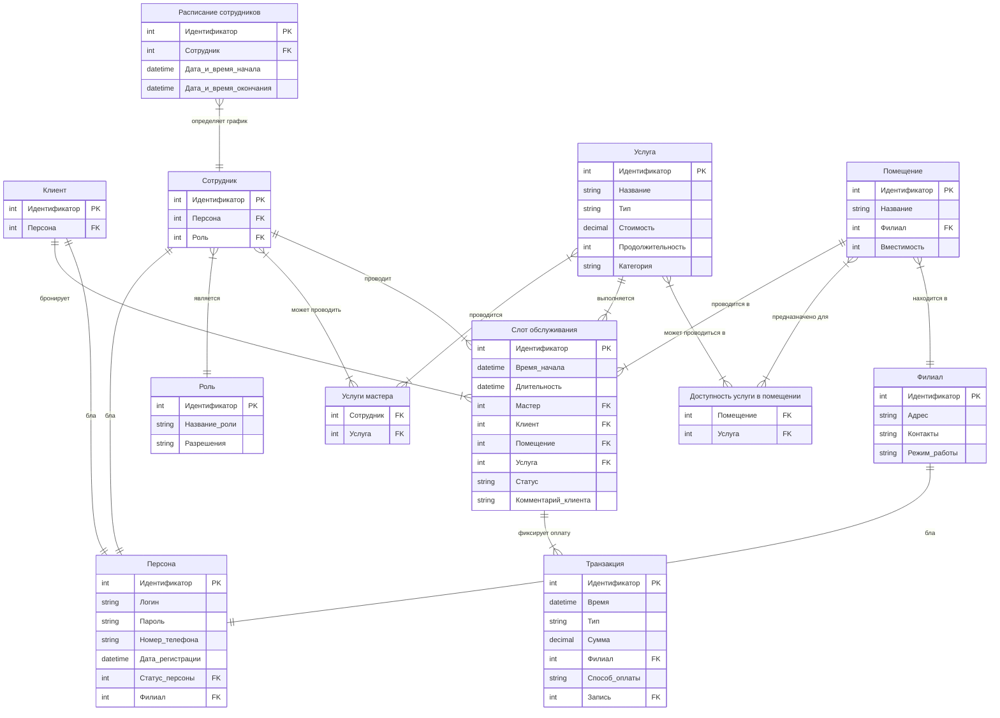

# Диаграмма классов

```mermaid
erDiagram
    CLIENT["Клиент"] {
        int Идентификатор PK
        int Персона FK
    }

    PERSON["Персона"] {
        int Идентификатор PK
        string Логин
        string Пароль
        string Номер_телефона
        datetime Дата_регистрации
        int Статус_персоны FK
        int Филиал FK
    }

    STAFF_SCHEDULE["Расписание сотрудников"] {
        int Идентификатор PK
        int Сотрудник FK
        datetime Дата_и_время_начала
        datetime Дата_и_время_окончания
    }

    EMPLOYEE["Сотрудник"] {
        int Идентификатор PK
        int Персона FK
        int Роль FK
    }

    ROLE["Роль"] {
        int Идентификатор PK
        string Название_роли
        string Разрешения
    }

    APPOINTMENT["Слот обслуживания"] {
        int Идентификатор PK
        datetime Время_начала
        datetime Длительность
        int Мастер FK
        int Клиент FK
        int Помещение FK
        int Услуга FK
        string Статус
        string Комментарий_клиента
    }

    TRANSACTION["Транзакция"] {
        int Идентификатор PK
        datetime Время
        string Тип
        decimal Сумма
        int Филиал FK
        string Способ_оплаты
        int Запись FK
    }

    SERVICE["Услуга"] {
        int Идентификатор PK
        string Название
        string Тип
        decimal Стоимость
        int Продолжительность
        string Категория
    }

    QUALIFICATION["Услуги мастера"] {
        int Сотрудник FK
        int Услуга FK
    }

    SERVICE_ROOM["Доступность услуги в помещении"] {
        int Помещение FK
        int Услуга FK
    }

    ROOM["Помещение"] {
        int Идентификатор PK
        string Название
        int Филиал FK
        int Вместимость
    }

    BRANCH["Филиал"] {
        int Идентификатор PK
        string Адрес
        string Контакты
        string Режим_работы
    }

    CLIENT ||--|{ APPOINTMENT : "бронирует"
    CLIENT ||--|| PERSON : "бла"
    EMPLOYEE ||--|| PERSON : "бла"
    BRANCH||--|| PERSON : "бла"
    STAFF_SCHEDULE }|--|| EMPLOYEE : "определяет график"
    EMPLOYEE }|--|| ROLE : "является"
    EMPLOYEE }|--|{ QUALIFICATION : "может проводить"
    SERVICE }|--|{ QUALIFICATION : "проводится"
    EMPLOYEE ||--|{ APPOINTMENT : "проводит"
    SERVICE ||--|{ APPOINTMENT : "выполняется"
    ROOM ||--|{ APPOINTMENT : "проводится в"
    APPOINTMENT ||--|{ TRANSACTION : "фиксирует оплату"
    SERVICE }|--|{ SERVICE_ROOM : "может проводиться в"
    ROOM }|--|{ SERVICE_ROOM : "предназначено для"
    ROOM }|--|| BRANCH : "находится в"
```
