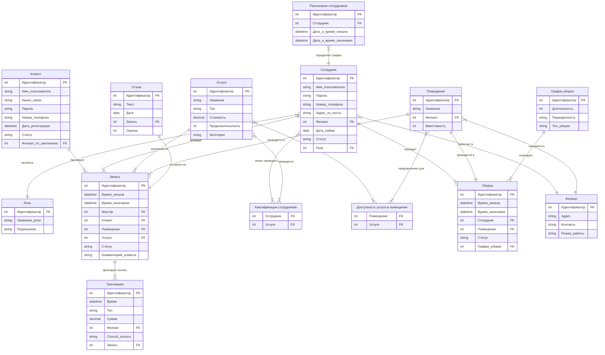

# BBS model — ER-диаграмма

```mermaid
erDiagram
    CLIENT["Клиент"] {
        int Идентификатор PK
        string Имя_пользователя
        string Канал_связи
        string Пароль
        string Номер_телефона
        datetime Дата_регистрации
        string Статус
        int Филиал_по_умолчанию FK
    }

    STAFF_SCHEDULE["Расписание сотрудников"] {
        int Идентификатор PK
        int Сотрудник FK
        datetime Дата_и_время_начала
        datetime Дата_и_время_окончания
    }

    EMPLOYEE["Сотрудник"] {
        int Идентификатор PK
        string Имя_пользователя
        string Пароль
        string Номер_телефона
        string Адрес_эл_почты
        int Филиал FK
        date Дата_найма
        string Статус
        int Роль FK
    }

    ROLE["Роль"] {
        int Идентификатор PK
        string Название_роли
        string Разрешения
    }

    APPOINTMENT["Запись"] {
        int Идентификатор PK
        datetime Время_начала
        datetime Время_окончания
        int Мастер FK
        int Клиент FK
        int Помещение FK
        int Услуга FK
        string Статус
        string Комментарий_клиента
    }

    REVIEW["Отзыв"] {
        int Идентификатор PK
        string Текст
        date Дата
        int Запись FK
        int Оценка
    }

    TRANSACTION["Транзакция"] {
        int Идентификатор PK
        datetime Время
        string Тип
        decimal Сумма
        int Филиал FK
        string Способ_оплаты
        int Запись FK
    }

    SERVICE["Услуга"] {
        int Идентификатор PK
        string Название
        string Тип
        decimal Стоимость
        int Продолжительность
        string Категория
    }

    QUALIFICATION["Квалификация сотрудников"] {
        int Сотрудник FK
        int Услуга FK
    }

    SERVICE_ROOM["Доступность услуги в помещении"] {
        int Помещение FK
        int Услуга FK
    }

    ROOM["Помещение"] {
        int Идентификатор PK
        string Название
        int Филиал FK
        int Вместимость
    }

    CLEANING["Уборка"] {
        int Идентификатор PK
        datetime Время_начала
        datetime Время_окончания
        int Сотрудник FK
        int Помещение FK
        string Статус
        int График_уборки FK
    }

    CLEANING_SCHEDULE["График уборок"] {
        int Идентификатор PK
        int Длительность
        string Периодичность
        string Тип_уборки
    }

    BRANCH["Филиал"] {
        int Идентификатор PK
        string Адрес
        string Контакты
        string Режим_работы
    }

    CLIENT ||--|{ APPOINTMENT : "бронирует"
    STAFF_SCHEDULE }|--|| EMPLOYEE : "определяет график"
    EMPLOYEE }|--|| BRANCH : "работает в"
    EMPLOYEE }|--|| ROLE : "является"
    EMPLOYEE ||--|{ CLEANING : "проводит"
    EMPLOYEE }|--|{ QUALIFICATION : "может проводить"
    SERVICE }|--|{ QUALIFICATION : "проводится"
    EMPLOYEE ||--|{ APPOINTMENT : "проводит"
    SERVICE ||--|{ APPOINTMENT : "выполняется"
    ROOM ||--|{ APPOINTMENT : "проводится в"
    REVIEW ||--|| APPOINTMENT : "оставлен на"
    APPOINTMENT ||--|{ TRANSACTION : "фиксирует оплату"
    SERVICE }|--|{ SERVICE_ROOM : "может проводиться в"
    ROOM }|--|{ SERVICE_ROOM : "предназначено для"
    ROOM ||--|| CLEANING : "проводится в"
    CLEANING_SCHEDULE ||--|{ CLEANING : "планирует"
    ROOM }|--|| BRANCH : "находится в"
```
